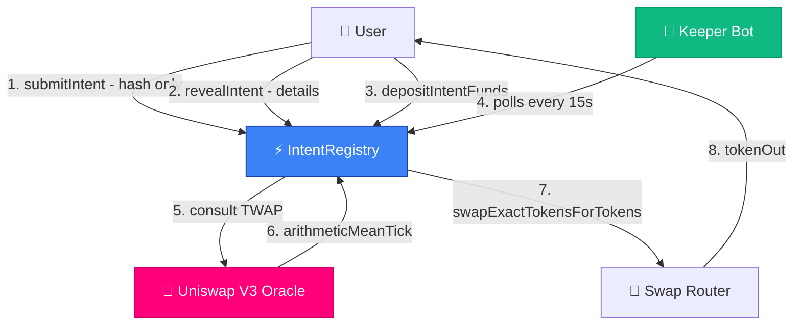
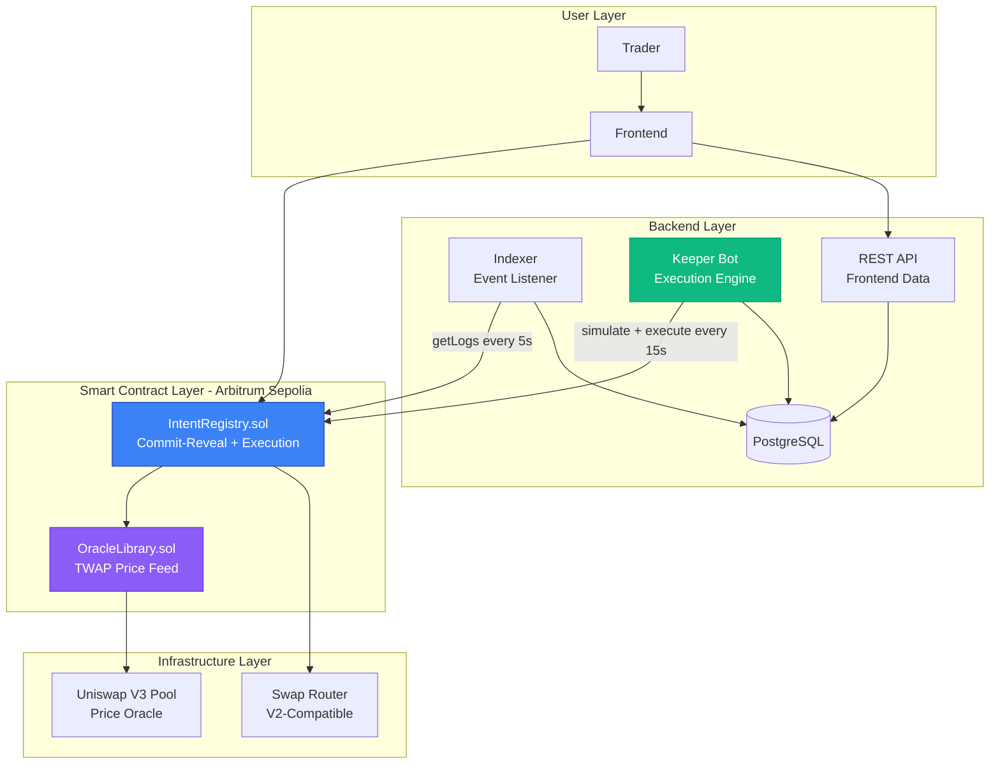
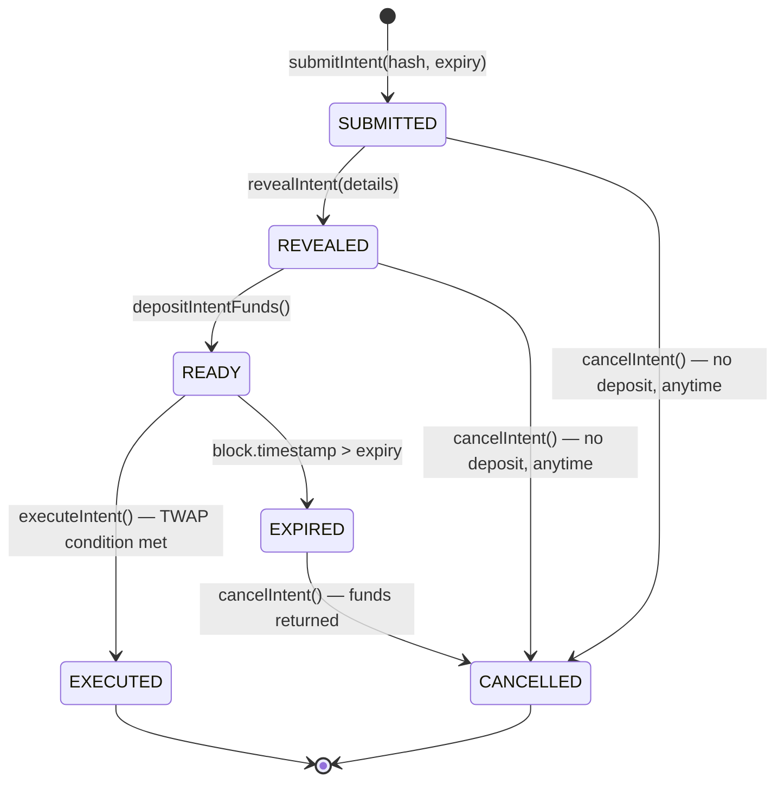
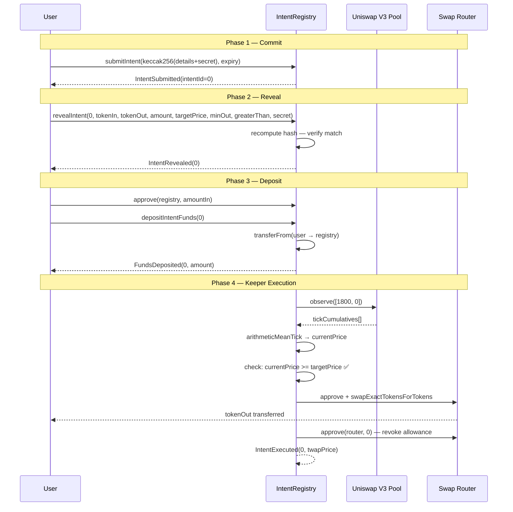

# [PROJECT_NAME]

**MEV-Resistant Intent-Based Trading Protocol on Arbitrum**

[PROJECT_NAME] is a decentralized limit order protocol that uses a commit-reveal scheme and Uniswap V3 TWAP oracles to let users place private, manipulation-resistant trade intents — executed by keepers only when real on-chain price conditions are met.

**Deployed Status:** 🚧 Deployed on Arbitrum Sepolia Testnet  
**Solidity:** `^0.8.20` — Foundry project  
**Test Coverage:** Unit · Fuzz · Invariant (Foundry)  
**Audit Status:** Pre-audit  
**Hackathon:** [Arbitrum Open House London — Online Buildathon](https://www.hackquest.io/hackathons/Arbitrum-Open-House-London-Online-Buildathon)

---

## Executive Summary

**What:** A decentralized limit order protocol where trade details stay hidden until execution conditions are met.  
**Why:** On-chain limit orders are front-runnable. Submitting your price target and token amounts in plaintext invites MEV bots to sandwich or frontrun your trade before it executes.  
**How:** Commit-reveal scheme + Uniswap V3 TWAP oracle + keeper network. You commit a hash of your intent, reveal only when ready, and a keeper executes when the 30-minute TWAP confirms the price condition — with slippage protection baked into the commitment so it can't be modified post-submission.

---

## The Problem

Standard on-chain limit orders expose everything:

```
submitOrder(tokenIn, tokenOut, amount, targetPrice)  ← all visible in mempool
```

MEV bots see this, watch the price approach your target, and frontrun your execution — buying before you, pushing the price past your target, and selling into your trade. You execute at a worse price, they profit.

---

## The Solution: Commit → Reveal → Execute

```
submitIntent(keccak256(details + secret), expiry)   ← only hash visible
        ↓
revealIntent(all details)                            ← details now on-chain
        ↓
depositIntentFunds()                                 ← tokens locked in registry
        ↓
[keeper monitors TWAP every 15 seconds]
        ↓
executeIntent()  ← fires only when TWAP condition is met
```

The hash commits you to every parameter — including `minAmountOut` (slippage protection) — before any details are visible. A frontrunner watching the mempool sees only a hash. By the time details are revealed, the 30-minute TWAP window makes single-block price manipulation economically irrational.

---

## Protocol Flow



---

## System Architecture



---

## Intent Lifecycle



---

## Complete Execution Sequence



---

## Smart Contracts

| Contract           | Address (Arbitrum Sepolia)       | Purpose                                       | Status            |
| ------------------ | -------------------------------- | --------------------------------------------- | ----------------- |
| IntentRegistry     | `[PLACEHOLDER — deploy address]` | Commit-reveal, execution gating, fund custody | 🚧 Deploy pending |
| MockERC20 (TokenA) | `[PLACEHOLDER]`                  | Demo token for testnet                        | 🚧 Deploy pending |
| MockERC20 (TokenB) | `[PLACEHOLDER]`                  | Demo token for testnet                        | 🚧 Deploy pending |
| Uniswap V3 Pool    | `[PLACEHOLDER]`                  | TWAP oracle for the demo pair                 | 🚧 Post-deploy    |

**Network:** Arbitrum Sepolia Testnet  
**Chain ID:** `421614`  
**RPC:** `https://sepolia-rollup.arbitrum.io/rpc`  
**Explorer:** `https://sepolia.arbiscan.io`  
**Uniswap V3 Factory:** `0x248AB79Bbb9bC29bB72f7Cd42F17e054Fc40188e`  
**Swap Router:** `0x101F443B4d1b059569D643917553c771E1b9663E`

---

## IntentRegistry.sol

**Purpose:** The core protocol contract. Manages the full lifecycle of trade intents: commitment, reveal, deposit, TWAP-gated execution, and cancellation.

### Key Security Properties

| Property               | Mechanism                                                                                 |
| ---------------------- | ----------------------------------------------------------------------------------------- |
| MEV resistance         | Details hidden in hash until reveal; 30-min TWAP makes block-level manipulation costly    |
| Slippage protection    | `minAmountOut` committed inside the hash — cannot be changed post-submission              |
| No expiry substitution | Expiry is stored at submit time and pulled from storage at reveal — not a caller argument |
| CEI pattern            | `intent.executed = true` set before any external calls                                    |
| Allowance hygiene      | Router approval revoked to 0 immediately after every swap                                 |
| Keeper-permissionless  | Anyone can call `executeIntent` — no trusted keeper required                              |

### State Variables

| Variable         | Type                                            | Description                          |
| ---------------- | ----------------------------------------------- | ------------------------------------ |
| `ROUTER`         | `IRouter immutable`                             | Uniswap-compatible swap router       |
| `CONTRACT_OWNER` | `address immutable`                             | Deployer — can only register pools   |
| `TWAP_INTERVAL`  | `uint32 = 1800`                                 | 30-minute TWAP window                |
| `nextIntentId`   | `uint256`                                       | Auto-incrementing intent counter     |
| `tokenPairPool`  | `mapping(address ⇒ mapping(address ⇒ address))` | Registered Uniswap V3 pools per pair |
| `intents`        | `mapping(uint256 ⇒ TradeIntent)`                | All intent state                     |

### TradeIntent Struct

| Field            | Type      | Set At  | Description                                                          |
| ---------------- | --------- | ------- | -------------------------------------------------------------------- |
| `user`           | `address` | Submit  | Intent owner                                                         |
| `tokenIn`        | `address` | Reveal  | Token being sold                                                     |
| `tokenOut`       | `address` | Reveal  | Token being bought                                                   |
| `amountIn`       | `uint256` | Reveal  | Amount to sell                                                       |
| `targetPrice`    | `uint256` | Reveal  | Price threshold                                                      |
| `minAmountOut`   | `uint256` | Reveal  | Slippage floor — committed in hash                                   |
| `greaterThan`    | `bool`    | Reveal  | `true` = sell when price ≥ target; `false` = buy when price ≤ target |
| `expiry`         | `uint256` | Submit  | Deadline timestamp                                                   |
| `commitmentHash` | `bytes32` | Submit  | `keccak256(all fields + secret)`                                     |
| `revealed`       | `bool`    | Reveal  | Phase flag                                                           |
| `deposited`      | `bool`    | Deposit | Fund custody flag                                                    |
| `executed`       | `bool`    | Execute | Terminal success flag                                                |
| `cancelled`      | `bool`    | Cancel  | Terminal cancel flag                                                 |

### Core Functions

**`submitIntent(bytes32 commitmentHash, uint256 expiry)`**  
Stores the hash commitment. No trade details visible. Reverts if expiry is not strictly in the future.

**`revealIntent(uint256 intentId, address tokenIn, address tokenOut, uint256 amountIn, uint256 targetPrice, uint256 minAmountOut, bool greaterThan, bytes32 secret)`**  
Recomputes the hash from caller-supplied plaintext + stored expiry. Reverts on any mismatch. Only the intent owner can reveal.

**`depositIntentFunds(uint256 id)`**  
Pulls `amountIn` of `tokenIn` from the user into the registry via `transferFrom`. Requires prior ERC-20 approval.

**`executeIntent(uint256 intentId)`**  
Fetches TWAP price from the registered Uniswap V3 pool, checks the price condition, and executes the swap via the router. Callable by anyone (keeper pattern).

**`cancelIntent(uint256 intentId)`**  
Owner-only. If deposited, refunds `amountIn` after expiry. If not deposited, cancellable at any time.

**`registerPool(address tokenA, address tokenB, address pool)`**  
Owner-only. Registers a Uniswap V3 pool as the TWAP oracle for a token pair.

### Commitment Hash Construction

```solidity
bytes32 commitmentHash = keccak256(abi.encodePacked(
    msg.sender,   // user
    tokenIn,
    tokenOut,
    amountIn,
    targetPrice,
    minAmountOut, // ← slippage bound is part of the commitment
    greaterThan,
    expiry,       // ← pulled from storage, not caller arg — prevents substitution attacks
    secret
));
```

---

## TWAP Oracle

The price gate in `executeIntent` uses Uniswap V3's time-weighted average price (TWAP) over a 30-minute window:

```solidity
uint32 public constant TWAP_INTERVAL = 1800; // 30 minutes

(int24 arithmeticMeanTick,) = OracleLibrary.consult(pool, TWAP_INTERVAL);
uint256 currentPrice = OracleLibrary.getQuoteAtTick(
    arithmeticMeanTick,
    uint128(intent.amountIn),
    intent.tokenIn,
    intent.tokenOut
);
```

**Why TWAP and not spot price?**  
Spot price can be moved in a single transaction. To manipulate a 30-minute TWAP, an attacker must hold the price off-market for 30 continuous minutes while arbitrageurs drain their position. The cost scales with the pool's liquidity depth and the size of the deviation — making manipulation economically irrational for any well-liquidity pool.

---

## Backend

The backend is a Node.js/TypeScript service with three co-located components:

### Indexer

Polls the chain every 5 seconds using `getLogs` in 2000-block chunks. Processes all contract events in block/log-index order and writes to PostgreSQL. Resumes from `lastIndexedBlock` on restart — no replaying from genesis.

Events indexed: `IntentSubmitted`, `IntentRevealed`, `FundsDeposited`, `IntentExecuted`, `IntentCancelled`

### Keeper Bot

Polls PostgreSQL every 15 seconds for `READY` intents (revealed + deposited + not expired). For each candidate, calls `simulateContract` first — the contract reverts with `PriceConditionNotMet` if the TWAP isn't there yet, costing no gas. Only when simulation passes does it send the real transaction. Includes a configurable gas price cap to prevent execution during gas spikes.

### REST API

| Method | Endpoint                         | Description                                              |
| ------ | -------------------------------- | -------------------------------------------------------- |
| `GET`  | `/api/v1/health`                 | Liveness probe                                           |
| `GET`  | `/api/v1/stats`                  | Aggregate counts by status                               |
| `GET`  | `/api/v1/intents`                | List intents — filterable by `user`, `status`, paginated |
| `GET`  | `/api/v1/intents/:intentId`      | Single intent by ID                                      |
| `GET`  | `/api/v1/users/:address/intents` | All intents for a wallet                                 |

**Stack:** Node.js · TypeScript · Express · Prisma · PostgreSQL · viem

---

## Frontend

> 🖼️ **[PLACEHOLDER — Frontend screenshots will be added here]**

**Stack:** `[PLACEHOLDER — e.g. Next.js · TypeScript · Tailwind · wagmi · RainbowKit]`  
**Live App:** `[PLACEHOLDER — deployment URL]`

---

## Project Structure

```
├── src/
│   ├── IntentRegistry.sol         ← core protocol contract
│   ├── interfaces/
│   │   ├── IERC20.sol
│   │   └── IRouter.sol
│   └── libraries/
│       └── OracleLibrary.sol      ← Uniswap V3 TWAP library (pragma patched for 0.8.x)
├── script/
│   ├── DeployAll.s.sol            ← deploys registry + mock tokens + creates V3 pool
│   └── DeployIntentRegistry.s.sol
├── test/
│   ├── unit/
│   │   ├── Mocks.sol              ← MockERC20, MockRouter, HarnessIntentRegistry
│   │   ├── IntentRegistryBase.t.sol
│   │   ├── IntentRegistryTest.t.sol
│   │   └── OracleLibraryTest.t.sol
│   ├── fuzz/
│   │   └── IntentRegistryFuzzTest.t.sol
│   └── invariant/
│       ├── IntentRegistryHandler.sol
│       └── IntentRegistryInvariantTest.t.sol
├── backend/
│   ├── src/
│   │   ├── index.ts               ← entry point
│   │   ├── indexer/indexer.ts
│   │   ├── keeper/keeper.ts
│   │   ├── api/routes.ts
│   │   ├── db/client.ts
│   │   ├── utils/client.ts
│   │   └── types/index.ts
│   └── prisma/schema.prisma
├── frontend/                      ← [PLACEHOLDER]
├── foundry.toml
└── README.md
```

---

## Quick Start

### Prerequisites

- [Foundry](https://getfoundry.sh) — `curl -L https://foundry.paradigm.xyz | bash`
- Node.js 20+
- PostgreSQL (or Docker)
- An Arbitrum Sepolia RPC URL (free from [Alchemy](https://alchemy.com) or [Infura](https://infura.io))

### Clone

```bash
git clone https://github.com/[PLACEHOLDER_GITHUB_USERNAME]/[PROJECT_NAME].git
cd [PROJECT_NAME]
```

### Smart Contracts

```bash
# Install Foundry dependencies
forge install

# Build
forge build

# Run all tests
forge test

# Run with coverage
forge coverage --ir-minimum

# Run specific test suites
forge test --match-contract IntentRegistryUnitTest -v
forge test --match-contract IntentRegistryFuzzTest -v
forge test --match-contract IntentRegistryInvariantTest -v
```

### Deploy to Arbitrum Sepolia

```bash
# Set environment variables
cp .env.example .env
# Fill in PRIVATE_KEY and ARBISCAN_API_KEY in .env
source .env

# Deploy everything (registry + mock tokens + Uniswap V3 pool)
forge script script/DeployAll.s.sol:DeployAll \
  --rpc-url https://sepolia-rollup.arbitrum.io/rpc \
  --private-key $PRIVATE_KEY \
  --broadcast \
  --verify \
  --verifier-url https://api-sepolia.arbiscan.io/api \
  --etherscan-api-key $ARBISCAN_API_KEY \
  -vvvv

# ⚠️ After deploying: add liquidity to the Uniswap V3 pool
# and wait 30 minutes before calling executeIntent
# The TWAP oracle needs 1800 seconds of observation history
```

### Backend

```bash
cd backend

# Install dependencies
npm install

# Configure environment
cp .env.example .env
# Fill in: RPC_URL, INTENT_REGISTRY_ADDRESS, KEEPER_PRIVATE_KEY, DATABASE_URL

# Set up PostgreSQL (Docker)
docker run --name intent-db \
  -e POSTGRES_USER=postgres \
  -e POSTGRES_PASSWORD=postgres \
  -e POSTGRES_DB=intent_registry \
  -p 5432:5432 -d postgres:16

# Run database migrations
npx prisma migrate dev --name init

# Start (indexer + keeper + API all in one process)
npm run dev
```

API will be available at `http://localhost:3001`.

---

## Testing

### Test Architecture

All tests use Foundry. A `HarnessIntentRegistry` subclass exposes `executeIntentWithMockPrice()` which replaces the two `OracleLibrary` calls with a caller-supplied price, allowing full execution logic to be tested without a live Uniswap pool.

### Unit Tests (`test/unit/`)

40 tests covering every function and every custom error selector:

- `submitIntent` — storage, ID increment, expiry boundary, event
- `revealIntent` — field updates, hash mismatch on every tampered field, owner check, double-reveal
- `depositIntentFunds` — balance delta, double-deposit, owner check, event
- `executeIntent` — both `greaterThan` directions, boundary at `targetPrice`, all guard reverts, router parameters, allowance reset, event
- `cancelIntent` — refund after expiry, pre-expiry revert, no-deposit any-time cancel, double-cancel, executed-intent revert
- `registerPool` — bidirectional storage, non-owner revert
- `OracleLibrary` — TWAP tick recovery, floor rounding, quote math, boundary ticks

### Fuzz Tests (`test/fuzz/`)

9 property-based tests using `bound()`:

| Property | What it proves                                                            |
| -------- | ------------------------------------------------------------------------- |
| P1       | Any future expiry accepted; past/present always reverts                   |
| P2 ×5    | Every single-field mutation in the commitment causes `RevealHashMismatch` |
| P3       | Price condition boundary is exact for both directions                     |
| P4       | Post-expiry execution always reverts regardless of price                  |
| P5       | Registry balance delta equals exactly `amountIn` on deposit               |
| P6       | Post-expiry cancel refunds exactly `amountIn`                             |
| P7       | Pre-expiry cancel on deposited intent always reverts                      |

### Invariant Tests (`test/invariant/`)

8 invariants verified across thousands of randomised action sequences:

| #   | Invariant                                                                         |
| --- | --------------------------------------------------------------------------------- |
| I1  | `registry.balance == deposited − executed − refunded` at all times                |
| I2  | `executed && cancelled` is never simultaneously true                              |
| I3  | `executed` flag is terminal — never resets to false                               |
| I4  | `cancelled` flag is terminal — never resets to false                              |
| I5  | Every revealed intent satisfies its original `commitmentHash`                     |
| I6  | `nextIntentId` never decreases                                                    |
| I7  | Router allowance is always zero between transactions                              |
| I8  | `ghost_totalRefunded` matches the sum of all on-chain cancelled+deposited intents |

---

## Integration Guide

### For Traders (Frontend / Direct Contract)

**1. Build the commitment hash (off-chain)**

```javascript
import { keccak256, encodePacked } from "viem";

const secret = keccak256(toHex(crypto.getRandomValues(new Uint8Array(32))));

const commitmentHash = keccak256(
  encodePacked(
    [
      "address",
      "address",
      "address",
      "uint256",
      "uint256",
      "uint256",
      "bool",
      "uint256",
      "bytes32",
    ],
    [
      userAddress,
      tokenIn,
      tokenOut,
      amountIn,
      targetPrice,
      minAmountOut,
      greaterThan,
      expiry,
      secret,
    ],
  ),
);

// Store `secret` securely — you need it to reveal
```

**2. Submit commitment**

```javascript
await registry.write.submitIntent([commitmentHash, expiry]);
```

**3. Reveal intent**

```javascript
await registry.write.revealIntent([
  intentId,
  tokenIn,
  tokenOut,
  amountIn,
  targetPrice,
  minAmountOut,
  greaterThan,
  secret,
]);
```

**4. Deposit funds**

```javascript
// Approve first
await tokenIn.write.approve([registryAddress, amountIn]);
// Then deposit
await registry.write.depositIntentFunds([intentId]);
```

**5. Wait for keeper execution**  
The backend keeper polls every 15 seconds. Once the 30-minute TWAP satisfies your condition, `executeIntent` fires and `tokenOut` lands in your wallet.

### For Keepers (DIY Execution)

Any address can call `executeIntent(intentId)`. The contract does all validation — if the price condition is not met it reverts, costing you only the simulation gas. No trusted role required.

---

## Security Considerations

### Design Decisions

**Why not use Chainlink or Pyth for the price feed?**  
The TWAP oracle is embedded in the Uniswap V3 pool itself — no external dependency, no trusted oracle network. The manipulation cost is entirely a function of the pool's on-chain liquidity depth, making it trustless and permissionless.

**Why does `revealIntent` not accept expiry as an argument?**  
Expiry is pulled from storage (set at submit time), not accepted as a caller argument during reveal. This prevents expiry substitution attacks where someone could extend a commitment's valid window after submission.

**Why is `minAmountOut` part of the commitment hash?**  
If slippage protection could be modified after reveal, a frontrunner could watch your reveal transaction and change your `minAmountOut` to 0 before execution. Committing it in the hash makes it immutable from the moment of `submitIntent`.

### Known Limitations

**1. Single-owner pool registry**

- ⚠️ Only `CONTRACT_OWNER` can register new token pair pools
- **Mitigation:** Governance / multisig migration planned post-hackathon

**2. No partial fills**

- ⚠️ Intents execute all-or-nothing (`amountIn` in full)
- **Mitigation:** Partial fill support is a planned V2 feature

**3. Keeper centralisation risk**

- ⚠️ If no keeper is running, intents expire without execution
- **Mitigation:** `executeIntent` is permissionless — anyone can run a keeper. The backend keeper is a reference implementation.

**4. TWAP manipulation on low-liquidity pools**

- ⚠️ On pools with very little liquidity the manipulation cost is lower
- **Mitigation:** Only register pools with sufficient liquidity depth. The 30-minute window is a strong deterrent at any meaningful liquidity level.

### Audit Status

**Status:** Pre-audit  
**Planned:** Post-hackathon  
**Scope:** `IntentRegistry.sol` + `OracleLibrary.sol`

---

## Development Roadmap

### Phase 1: MVP ✅ Complete

- ✅ `IntentRegistry.sol` — full commit-reveal-execute lifecycle
- ✅ TWAP oracle integration via Uniswap V3 `OracleLibrary`
- ✅ Unit, fuzz, and invariant test suite (Foundry)
- ✅ Node.js backend — indexer, keeper bot, REST API
- ✅ Arbitrum Sepolia deployment

### Phase 2: UX & Decentralisation (4–6 weeks)

- 🚧 Frontend — wallet connect, intent dashboard, real-time status
- 🚧 Multi-sig pool registry governance
- 🚧 Partial fill support
- 🚧 Keeper incentive mechanism (tip from user)

### Phase 3: Mainnet (8–12 weeks)

- ⏳ Security audit
- ⏳ Arbitrum One mainnet deployment
- ⏳ Integration with major Uniswap V3 pools (WETH/USDC, WETH/ARB, etc.)
- ⏳ Keeper network documentation + open keeper registry

### Phase 4: Ecosystem (12–24 weeks)

- ⏳ Multi-hop paths (more than 2 tokens)
- ⏳ Cross-chain intent support
- ⏳ SDK for frontend integrations
- ⏳ DAO governance for pool registry

---

## Technical Stack

- **Smart Contracts:** Solidity `^0.8.20`, Foundry
- **Oracle:** Uniswap V3 `OracleLibrary` — TWAP via `consult()` + `getQuoteAtTick()`
- **Testing:** Foundry — unit, fuzz (`bound()`), invariant (handler pattern)
- **Backend:** Node.js · TypeScript · Express · Prisma ORM · PostgreSQL · viem
- **Frontend:** `[PLACEHOLDER]`
- **Deployment:** Arbitrum Sepolia — Uniswap V3 factory + real swap router, no mock infrastructure

---

## FAQ

**Q: Why use a commit-reveal scheme instead of just submitting the order encrypted?**  
A: On-chain data is always eventually visible. A commit-reveal scheme is trustless — the contract itself verifies the hash match at reveal time, with no trusted third party needed to decrypt anything.

**Q: Can the keeper steal my funds?**  
A: No. `executeIntent` sends `tokenOut` directly to `intent.user` — the original submitter's wallet. The keeper triggering the function has no ability to redirect the output.

**Q: What happens if my intent expires before the price condition is met?**  
A: Your intent becomes `EXPIRED`. Call `cancelIntent` after expiry to recover your deposited `tokenIn`.

**Q: Why Arbitrum?**  
A: Low gas costs make the multi-step flow (submit → reveal → deposit → execute) economically viable for smaller trade sizes. Uniswap V3 is fully deployed on Arbitrum with deep liquidity, giving the TWAP oracle real manipulation resistance.

**Q: Can I run my own keeper?**  
A: Yes. `executeIntent(intentId)` is callable by any address. The backend keeper in this repo is a reference implementation. In production, keeper incentives (gas rebates or tips) would be added to attract competitive keeper networks.

**Q: How is the target price expressed?**  
A: `targetPrice` is expressed as `getQuoteAtTick(tick, amountIn, tokenIn, tokenOut)` — i.e. how many units of `tokenOut` you expect to receive for your `amountIn` of `tokenIn`. This matches exactly what the contract computes when checking the condition.

---

## Team

- **Khushi Barnwal** — Smart Contract Engineering & Backend
- **Nayab Khan** — Smart Contract Engineering & Protocol Design

---

## Contributing

Contributions are welcome. Please open an issue before submitting a PR for non-trivial changes.

```bash
git clone https://github.com/[PLACEHOLDER_GITHUB_USERNAME]/[PROJECT_NAME].git
cd [PROJECT_NAME]
forge install
forge build
forge test
```

---

## Contact

- **GitHub:** [PLACEHOLDER]
- **Issues:** [PLACEHOLDER — link to issues]

---

## License

MIT License — see [LICENSE](./LICENSE)

---

_Built for the [Arbitrum Open House London — Online Buildathon](https://www.hackquest.io/hackathons/Arbitrum-Open-House-London-Online-Buildathon)_
